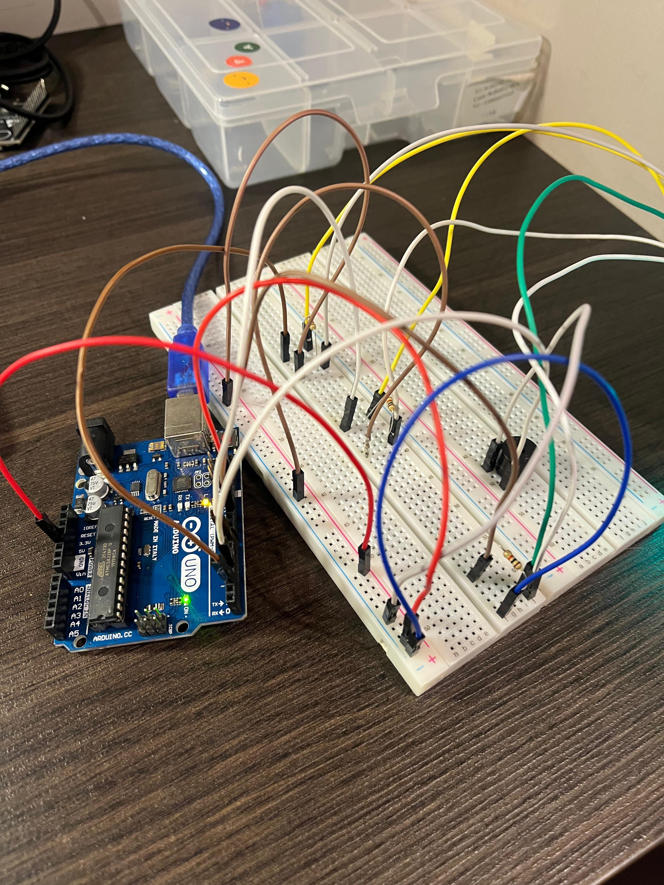

# Semáforo Offline

Este repositório apresenta a atividade de programação da terceira semana do módulo 4 do Inteli - Instituto de Tecnologia e Liderança. Nele, você encontrará a documentação detalhada para a montagem e programação de um semáforo de trânsito, utilizando uma protoboard, LEDs e um buzzer. Este projeto foi desenvolvido pelo aluno Pablo Azevedo, da turma 11, grupo 01.

## Parte 1: Montagem Física do Semáforo

### Requisitos para a Montagem

Antes de começar, certifique-se de ter os seguintes materiais:

- Arduino Uno
- Protoboard
- LEDs: vermelho, amarelo e verde
- Resistores
- Buzzer
- Fios jumper
- Cabo USB para conectar o Arduino ao computador
- Arduino IDE instalada
- Moldura de um semáforo feita em MDF

### Instruções de Montagem

1. **Posicionamento dos LEDs e Resistores:**  
Conecte os LEDs nas aberturas disponíveis na moldura de um semáforo feita de MDF. Utilize jumpers para conectar os LEDs à protoboard, representando as cores do semáforo: vermelho, amarelo e verde. Adicione um resistor em série a cada LED para limitar a corrente e proteger os componentes.


2. **Conexão dos Fios:**  
Organize os fios na protoboard para conectar os LEDs e o buzzer aos pinos do Arduino. Você pode conferir a disposição dos fios na imagem abaixo, realizada no Tinkercad. 

*IMPORTANTE: No Tinkercad, os LEDs estão conectados diretamente à protoboard; no nosso modelo físico, eles serão conectados por meio de jumpers.*


<div align="center">
  <p><strong>Figura 1:</strong> Tinkercad da organização dos leds e jumpers</p>
  
  <p><em>Créditos: material produzido pelo autor (2024)</em></p>
</div>

3. **Esquema de Conexões:**
   - LED vermelho: pino digital 2 do Arduino
   - LED amarelo: pino digital 10 do Arduino
   - LED verde: pino digital 7 do Arduino
   - Buzzer: pino digital 4 do Arduino

   A organização dos fios deve seguir o esquema para garantir que a montagem fique clara e funcional.

4. **Verificação de Montagem:**  
   Certifique-se de que todos os componentes estejam corretamente conectados e prontos para a programação.

## Parte 2: Programação e Lógica do Semáforo

O código controla a sequência das luzes do semáforo com a temporização correta para cada fase, como segue:
- Luz vermelha: 6 segundos (buzzer apita para alertar os pedestres de que é perigoso atravessar)
- Luz amarela: 2 segundos
- Luz verde: 2 segundos
- Luz verde com tempo adicional para pedestres: +2 segundos
- Luz amarela: 2 segundos

O ciclo é repetido continuamente.

### Código para Controle do Semáforo

```cpp
void setup()
{
  pinMode(2, OUTPUT);   // Vermelho
  pinMode(10, OUTPUT);  // Amarelo
  pinMode(7, OUTPUT);   // Verde
  pinMode(4, OUTPUT);   // Buzzer
}

void loop()
{
  // Luz vermelha: 6 segundos com buzzer
  digitalWrite(2, HIGH);
  digitalWrite(10, LOW);
  digitalWrite(7, LOW);
  digitalWrite(4, HIGH);   // Liga o buzzer
  delay(6000);

  // Luz amarela: 2 segundos, buzzer desligado
  digitalWrite(2, LOW);
  digitalWrite(10, HIGH);
  digitalWrite(7, LOW);
  digitalWrite(4, LOW);    // Desliga o buzzer
  delay(2000);

  // Luz verde: 2 segundos, buzzer desligado
  digitalWrite(2, LOW);
  digitalWrite(10, LOW);
  digitalWrite(7, HIGH);
  delay(2000);

  // Luz verde com tempo adicional para pedestres: +2 segundos, buzzer desligado
  delay(2000);

  // Luz amarela: 2 segundos, buzzer desligado
  digitalWrite(2, LOW);
  digitalWrite(10, HIGH);
  digitalWrite(7, LOW);
  delay(2000);
}
```

No código, observa-se que o buzzer emite um alarme sempre que a luz vermelha está acesa. Essa funcionalidade foi implementada com o objetivo de alertar os pedestres de que é perigoso atravessar a faixa de pedestres nesse momento. Ao gerar esse alerta sonoro, buscamos contribuir para a redução de acidentes de trânsito.

## Fotos

<div align="center">
  <p><strong>Figura 2:</strong> Imagem 1 do circuito do semáforo</p>
  
  <p><em>Créditos: material produzido pelo autor (2024)</em></p>
</div>

<div align="center">
  <p><strong>Figura 3:</strong> Imagem 2 do circuito do semáforo</p>
  
  <p><em>Créditos: material produzido pelo autor (2024)</em></p>
</div>

<div align="center">
  <p><strong>Figura 4:</strong> Imagem 3 do circuito do semáforo</p>
  
  <p><em>Créditos: material produzido pelo autor (2024)</em></p>
</div>

<div align="center">
  <p><strong>Figura 5:</strong> Imagem 4 do circuito do semáforo</p>
  
  <p><em>Créditos: material produzido pelo autor (2024)</em></p>
</div>

## Vídeos

1. Para acessar o primeiro vídeo do semáforo em funcionamento, clique [aqui](https://github.com/zzaved/semaforo-offline/blob/main/assets/video_semaforo.mp4).

2. Para acessar o segundo vídeo do semáforo em funcionamento, clique [aqui](https://github.com/zzaved/semaforo-offline/blob/main/assets/video2_semaforo.mp4).

## Conclusão

Este projeto permitiu aplicar a lógica de controle de um semáforo e implementar o circuito físico na protoboard. O código demonstrado e as imagens ilustram o processo e os resultados obtidos, com o semáforo alternando entre as fases de forma contínua e precisa.

# Avaliação de Pares

## Avaliação 1:

### Avaliadora: Mariella Kamezawa
| Critério                                                                                                 | Contempla (Pontos) | Contempla Parcialmente (Pontos) | Não Contempla (Pontos) | Observações do Avaliador |
|---------------------------------------------------------------------------------------------------------|--------------------|----------------------------------|--------------------------|---------------------------|
| Montagem física com cores corretas, boa disposição dos fios e uso adequado de resistores                | Até 3              | Até 1,5                            | 0                        |                 3          |
| Temporização adequada conforme tempos medidos com auxílio de algum instrumento externo                  | Até 3              | Até 1,5                          | 0                        |                   3        |
| Código implementa corretamente as fases do semáforo e estrutura do código (variáveis representativas e comentários) | Até 3              | Até 1,5                          | 0                        |                3           |
| Extra: Implmeentou um componente de liga/desliga no semáforo e/ou usou ponteiros no código | Até 1              |  Até 0,5                         | 0                        |         1                  |3
|  |                                                             |  | **Pontuação Total** |10|

## Avaliação 2:

### Avaliador: Mariana de Paula 
| Critério                                                                                                 | Contempla (Pontos) | Contempla Parcialmente (Pontos) | Não Contempla (Pontos) | Observações do Avaliador |
|---------------------------------------------------------------------------------------------------------|--------------------|----------------------------------|--------------------------|---------------------------|
| Montagem física com cores corretas, boa disposição dos fios e uso adequado de resistores                | Até 3              | Até 1,5                            | 0                        |                 3          |
| Temporização adequada conforme tempos medidos com auxílio de algum instrumento externo                  | Até 3              | Até 1,5                          | 0                        |                   3        |
| Código implementa corretamente as fases do semáforo e estrutura do código (variáveis representativas e comentários) | Até 3              | Até 1,5                          | 0                        |                3           |
| Extra: Implmeentou um componente de liga/desliga no semáforo e/ou usou ponteiros no código | Até 1              |  Até 0,5                         | 0                        |         1                  |3
|  |                                                             |  | **Pontuação Total** |10|
